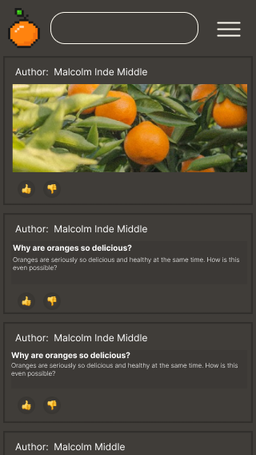

## Table of contents

-   [Overview](#overview)
    -   [Screenshot](#screenshot)
    -   [Links](#links)
-   [My process](#my-process)
    -   [Built with](#built-with)
    -   [What I learned](#what-i-learned)
-   [Author](#author)
-   [Acknowledgments](#acknowledgments)

## Overview

Simple block template.

### Screenshot

<!--  -->

### Links

-   Live Site URL: https://main--cerulean-semifreddo-d756c7.netlify.app/profiles/1

## My process

I put the design together in in this Figma file: https://www.figma.com/file/E6BGv3c7YJXeVLul1FPFd9/Untitled?type=design&node-id=0%3A1&mode=design&t=QIEC7Z7oHc8hrByH-1 I then put the diferrent elements into fitting HTML tags, and started styling it, for mobile.

### Built with

-   Semantic HTML5 markup
-   CSS custom properties
-   Flexbox
-   Mobile-first workflow
-   Vite + React + TS

### What I learned

Using React-router-dom

## Author

-   Website - [havardekodehode]("https://havardekodehode.github.io/portfolio/")

## Acknowledgments

Thanks to Jørgen, who assigned this task.
